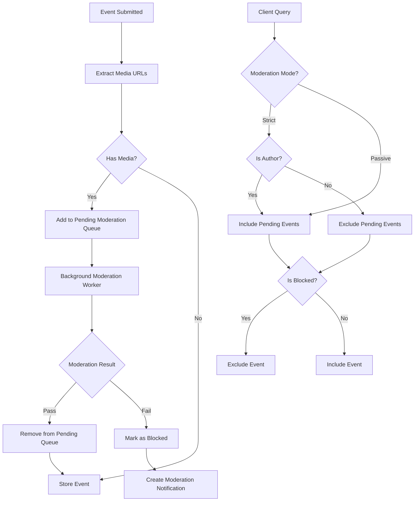

# Moderation Modes

HORNETS-Nostr-Relay supports two moderation modes for handling events with media content that requires moderation:

## Strict Mode (Default)

In strict mode, events with media content (images, videos) are not queryable by regular users while they are pending moderation. This ensures that potentially problematic content is not visible to users until it has been properly moderated.

However, the authors of the events can still query their own events even while they are pending moderation. This allows authors to see their own content immediately after posting, providing a better user experience for content creators.

Once moderation is complete:
- Events that pass moderation become queryable by everyone
- Events that fail moderation are blocked and not queryable by anyone

## Passive Mode

In passive mode, events with media content are queryable by everyone while they are pending moderation. This provides a more immediate user experience, as content is visible right away without waiting for moderation.

Once moderation is complete:
- Events that pass moderation remain queryable by everyone
- Events that fail moderation are blocked and not queryable by anyone

## Configuration

The moderation mode can be configured in your `config.json` file:

```json
{
  "moderation_mode": "strict"
}
```

To change to passive mode:

```json
{
  "moderation_mode": "passive"
}
```

If not specified, the default mode is "strict".

## Implementation Details

The moderation system works as follows:

1. When an event with media content is submitted, it's added to the pending moderation queue
2. The moderation worker processes events in the queue by analyzing the media content
3. Based on the moderation result, the event is either approved or blocked
4. The query filtering system applies the appropriate visibility rules based on the configured moderation mode

### Moderation Flow



This moderation system provides flexibility while ensuring that inappropriate content can be filtered out effectively.
