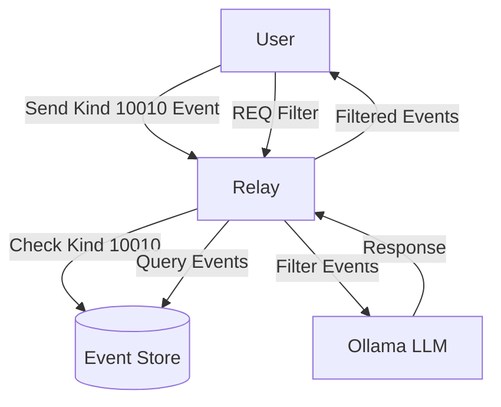

# Content Filtering for Nostr with Direct Ollama Integration

This package implements personalized content filtering for Nostr events via direct integration with Ollama LLMs. It provides users with the ability to create customized feeds based on their personal preferences, while maintaining the decentralized nature of Nostr.

## Overview

The content filtering system enables users to create customized feeds based on their preferences. It offers two filtering methods:

1. **Mute Word Filtering**: Available to all users, this simple string-matching filter removes content containing specific words.
2. **AI-Based Filtering**: Available only to paid subscribers, this advanced filtering uses local Large Language Models (LLMs) via Ollama to intelligently filter content based on custom instructions.

This streamlined architecture eliminates the need for an intermediate API server while preserving server resources by limiting AI filtering to paid users.



## How to Use (For Clients)

### 1. Enable Content Filtering

To enable content filtering, send a kind 10010 event to the relay with your filtering preferences:

#### Using Mute Words (Available to All Users)

```json
{
  "kind": 10010,
  "content": "I want to filter my feed",
  "tags": [
    ["enabled", "true"],
    ["mute", "politics,spam,nsfw"]
  ]
}
```

The mute words tag contains a comma-separated list of words to filter out. Any post containing these words will be removed from your feed.

#### Using AI Filtering (Paid Subscribers Only)

```json
{
  "kind": 10010,
  "content": "I want to filter my Nostr feed based on these preferences:\nRule 1: Include content about technology and programming.\nRule 2: Filter out political content.\nRule 3: Include thoughtful discussions, even if controversial.",
  "tags": [
    ["enabled", "true"]
  ]
}
```

The `content` field contains your custom filtering instructions that will be processed by the AI model. This feature is only available to users with a paid subscription.

> **Note**: You can use both mute words and AI filtering together if you're a paid subscriber.

### 2. Update Your Preferences

To update your preferences, simply publish a new kind 10010 event. The relay will automatically replace your previous preferences.

### 3. Disable Filtering

To disable filtering, send a kind 10010 event with filtering disabled:

```json
{
  "kind": 10010,
  "content": "{\"enabled\":false,\"instructions\":\"\"}"
}
```

### 4. Filter Results

After enabling filtering, all kind 1 (text note) events you request through the relay will automatically be filtered according to your preferences. No additional action is needed.

## Example Filtering Options

### Mute Word Examples (All Users)

Simple word lists that will filter out posts containing these terms:

- Basic filtering: `politics,spam,nsfw,gambling`
- Cryptocurrency spam: `airdrop,free tokens,giveaway,get rich`
- Content warnings: `gore,violence,disturbing`

### AI Filter Instructions (Paid Subscribers Only)

You can customize your AI filters with any instructions. Here are some examples:

**Technology Focus**
```
I want to filter my Nostr feed based on these preferences:
Rule 1: Include content about technology, programming, and cryptocurrency.
Rule 2: Filter out political rants and divisive content.
Rule 3: Include thoughtful discussions, even if controversial, as long as they're respectful.
```

**Art and Creativity Focus**
```
I want to filter my Nostr feed based on these preferences:
Rule 1: Show content about art, music, design, and creative inspiration.
Rule 2: Filter out financial and market discussions.
Rule 3: Include content with images and embedded media.
```

## Subscription Requirements

The filtering system has different capabilities depending on your subscription status:

| Feature | Free Users | Paid Subscribers |
|---------|------------|------------------|
| Mute Word Filtering | ✅ Available | ✅ Available |
| AI-Based Filtering | ❌ Not available | ✅ Available (active subscriptions only) |
| Custom Instructions | ❌ Not available | ✅ Available (active subscriptions only) |
| Number of Mute Words | Unlimited | Unlimited |

**Important**: AI filtering is only available to paid subscribers with active (non-expired) subscriptions. Once a subscription expires, the user will still have access to mute word filtering but will lose access to AI filtering until they renew their subscription.

To upgrade to a paid subscription and access AI filtering, please refer to the relay's subscription options.

## Subscription Verification

The system uses a robust dual verification approach to determine if a user has an active paid subscription:

1. **Primary Method**: Checks the PaidSubscriber database table for the user's record and verifies that the current date is before the subscription expiration date.

2. **Fallback Method**: If no database record is found, the system checks NIP-888 events for the user. It verifies that:
   - The subscription tier is not a free tier
   - The subscription has not expired (based on the expiration timestamp in the event)

This dual approach ensures system resilience and graceful degradation if one verification method fails.

## Privacy and Security

This implementation includes several security measures:

1. **Private Preferences**: Your kind 10010 events (filter preferences) are only visible to you. The relay ensures that only the event author can see their own preferences.

2. **No Content Leakage**: When content is filtered, the relay simply doesn't send it to you - there's no indication to other users that something was filtered.

3. **Local Processing**: Direct integration with Ollama LLM means all content filtering happens locally, so your data isn't sent to large cloud providers.

4. **Optional Usage**: Filtering is fully opt-in. If you never send a kind 10010 event, nothing changes in your Nostr experience.

5. **Resource Efficiency**: By limiting AI filtering to paid subscribers, we ensure the relay remains performant for all users.

## Configuration (For Relay Operators)

The following settings can be configured in `config.json`:

```json
{
  "ollama_url": "http://localhost:11434/api/generate",
  "ollama_model": "gemma3:1b",
  "ollama_timeout": 10000,
  "content_filter_cache_size": 10000,
  "content_filter_cache_ttl": 60,
  "content_filter_enabled": true
}
```

- `ollama_url`: URL of the Ollama API endpoint
- `ollama_model`: LLM model to use (e.g., gemma3:1b, llama3:8b, etc.)
- `ollama_timeout`: API request timeout in milliseconds (recommended: 10000ms or more)
- `content_filter_cache_size`: Maximum number of cached filter results
- `content_filter_cache_ttl`: Cache time-to-live in minutes
- `content_filter_enabled`: Master switch to enable/disable the feature

## Technical Details

- Content filtering is only applied to kind 1 (text note) events for efficiency
- Mute word filtering uses simple string matching for high performance and is available to all users
- AI filtering (for paid subscribers with active subscriptions only):
  - Subscription expiration is checked before applying AI filtering
  - Batch processing is used for efficient handling of multiple events
  - Events are automatically grouped into batches when their count exceeds the threshold
  - Each batch is processed as a single API call, reducing HTTP overhead
  - If the batch API fails, the system gracefully falls back to individual processing
- Intelligent caching minimizes API calls for previously seen events
- Parallel processing ensures high throughput even with large event volumes
- The implementation includes graceful degradation if the AI service is unavailable
- Subscription status is checked using both the PaidSubscriber table and NIP-888 events, with verification of expiration dates

## Colorized Logging

The content filter implementation includes a colorized logging system that makes monitoring and debugging easier:

```
[CONTENT FILTER] APPLYING MUTE WORD FILTER FOR USER: pubkey...
[CONTENT FILTER] USER pubkey IS A PAID SUBSCRIBER (VALID UNTIL 2025-05-15), APPLYING AI FILTERING
[CONTENT FILTER] USER pubkey HAS EXPIRED PAID SUBSCRIPTION (EXPIRED ON 2025-03-01), SKIPPING AI FILTERING
[CONTENT FILTER] EXEMPT EVENT: ID=abc123... (non-filterable event kind)
[CONTENT FILTER] EVENT TO FILTER: ID=def456..., Content: "This is the content to filter..."
[CONTENT FILTER] MUTED WORD: 'politics' found in event ID=ghi789...
[CONTENT FILTER] OLLAMA RESPONSE: true
[CONTENT FILTER] PASSED: ID=def456...
[CONTENT FILTER] RESULTS: 2/7 filterable events passed filter, 1 exempt events
[CONTENT FILTER] NON-PAID USER: Skipping AI filtering, 5 events passed mute filtering, 2 exempt events
```

Color coding provides visual clarity in logs:
- **Cyan**: General processing information and event listings
- **Green**: Events that pass filtering and are included in the feed
- **Red**: Events that are filtered out and excluded from the feed
- **Yellow**: Summary results and statistics
- **Purple**: Unusual or unclear responses from the LLM

This makes it easy to quickly identify which events are being filtered and why, helping with both debugging and verifying that the filter is working correctly.

## Client Integration

For client developers, no additional integration is required to use this feature. Simply:

1. Enable your users to create and manage kind 10010 events
2. Use the standard `REQ` mechanism to request events
3. The relay will handle filtering automatically

The entire process is transparent to clients once the user's preferences are set.
