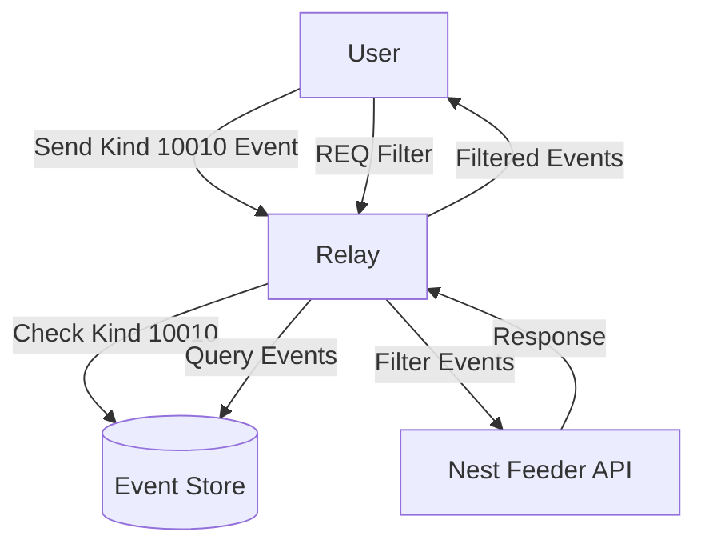

# Nest Feeder Content Filtering for Nostr

This package implements personalized content filtering for Nostr events via integration with the Nest Feeder API. It provides users with the ability to create customized feeds based on their personal preferences, while maintaining the decentralized nature of Nostr.

## Overview

Nest Feeder is a personalized content filter for Nostr events that enables users to create customized feeds based on their preferences. It uses local LLMs via Ollama to determine whether content matches a user's interests.



## How to Use (For Clients)

### 1. Enable Content Filtering

To enable content filtering, send a kind 10010 event to the relay with your filtering preferences:

```json
{
  "kind": 10010,
  "content": "{\"enabled\":true,\"instructions\":\"I want to filter my Nostr feed based on these preferences:\\nRule 1: Include content about technology and programming.\\nRule 2: Filter out political content.\\nRule 3: Include thoughtful discussions, even if controversial.\"}"
}
```

The `content` field can have two formats:

1. **JSON string** with:
   - `enabled`: Boolean indicating if filtering is active
   - `instructions`: String with your custom instructions

2. **Plain text** instructions (in this case, filtering is assumed to be enabled)

### 2. Update Your Preferences

To update your preferences, simply publish a new kind 10010 event. The relay will automatically replace your previous preferences.

### 3. Disable Filtering

To disable filtering, send a kind 10010 event with filtering disabled:

```json
{
  "kind": 10010,
  "content": "{\"enabled\":false,\"instructions\":\"\"}"
}
```

### 4. Filter Results

After enabling filtering, all kind 1 (text note) events you request through the relay will automatically be filtered according to your preferences. No additional action is needed.

## Example Filter Instructions

You can customize your filters with any instructions. Here are some examples:

**Technology Focus**
```
I want to filter my Nostr feed based on these preferences:
Rule 1: Include content about technology, programming, and cryptocurrency.
Rule 2: Filter out political rants and divisive content.
Rule 3: Include thoughtful discussions, even if controversial, as long as they're respectful.
```

**Art and Creativity Focus**
```
I want to filter my Nostr feed based on these preferences:
Rule 1: Show content about art, music, design, and creative inspiration.
Rule 2: Filter out financial and market discussions.
Rule 3: Include content with images and embedded media.
```

## Privacy and Security

This implementation includes several security measures:

1. **Private Preferences**: Your kind 10010 events (filter preferences) are only visible to you. The relay ensures that only the event author can see their own preferences.

2. **No Content Leakage**: When content is filtered, the relay simply doesn't send it to you - there's no indication to other users that something was filtered.

3. **Local Processing**: The Nest Feeder API uses local LLMs via Ollama, so your data isn't sent to large cloud providers.

4. **Optional Usage**: Filtering is fully opt-in. If you never send a kind 10010 event, nothing changes in your Nostr experience.

## Configuration (For Relay Operators)

The following settings can be configured in `config.json`:

```json
{
  "nest_feeder_url": "http://localhost:8080/moderate",
  "nest_feeder_timeout": 500,
  "nest_feeder_cache_size": 10000,
  "nest_feeder_cache_ttl": 60,
  "nest_feeder_enabled": true
}
```

- `nest_feeder_url`: URL of the Nest Feeder API endpoint
- `nest_feeder_timeout`: API request timeout in milliseconds
- `nest_feeder_cache_size`: Maximum number of cached filter results
- `nest_feeder_cache_ttl`: Cache time-to-live in minutes
- `nest_feeder_enabled`: Master switch to enable/disable the feature

## Technical Details

- Content filtering is only applied to kind 1 (text note) events for efficiency
- Batch processing is used for efficient handling of multiple events:
  - Events are automatically grouped into batches when their count exceeds the threshold
  - Each batch is processed as a single API call, reducing HTTP overhead
  - If the batch API fails, the system gracefully falls back to individual processing
- Intelligent caching minimizes API calls for previously seen events
- Parallel processing ensures high throughput even with large event volumes
- The implementation includes graceful degradation if the API is unavailable

## Client Integration

For client developers, no additional integration is required to use this feature. Simply:

1. Enable your users to create and manage kind 10010 events
2. Use the standard `REQ` mechanism to request events
3. The relay will handle filtering automatically

The entire process is transparent to clients once the user's preferences are set.
